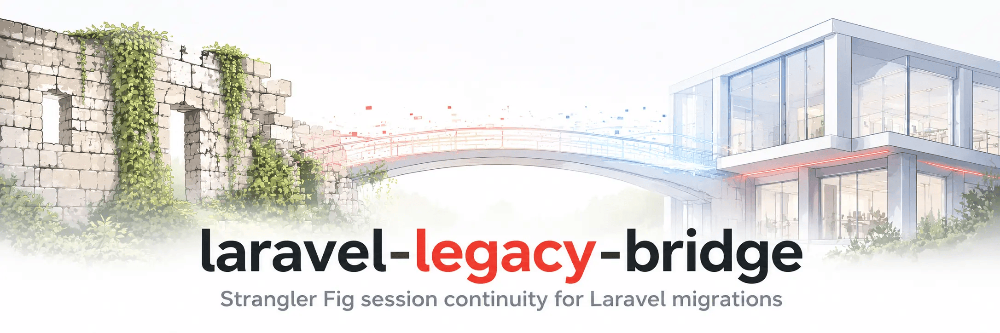

<picture>
    <source media="(prefers-color-scheme: dark)" srcset="art/header-dark.png">
    
</picture>

<p align="center">
    <a href="https://github.com/chr15k/laravel-legacy-bridge/actions"></a>
    <a href="https://packagist.org/packages/chr15k/laravel-legacy-bridge"></a>
    <a href="https://packagist.org/packages/chr15k/laravel-legacy-bridge"></a>
    <a href="https://packagist.org/packages/chr15k/laravel-legacy-bridge"></a>
</p>

------

**Laravel Legacy Bridge** provides session continuity between legacy PHP applications and Laravel.

Users authenticated in one application are seamlessly authenticated in the other, allowing both systems to coexist without interrupting the user experience.

It is ideal for incremental Laravel migrations, framework upgrades, and any scenario where two applications need to share authenticated sessions.

---

## The problem

Whenever two applications need to share users, authentication becomes the hardest part.

A user may already have a perfectly valid authenticated session in your legacy application, but Laravel has no knowledge of it. Without a bridge, users encounter an unexpected login prompt as soon as they reach a Laravel-handled route.

**Laravel Legacy Bridge** establishes session continuity by:

- Reading the legacy session cookie on every unauthenticated request
- Fetching and decoding the legacy session payload from the legacy session store
- Resolving the authenticated user using a configurable strategy
- Continuing the user's authenticated session in Laravel
- Dispatching typed events for successful bridges, expected failures, and unexpected exceptions
- Optionally carrying additional session context such as locale, cart ID, or other application data
- Invalidating the legacy session after a successful bridge

The bridge runs only once per user. After Laravel establishes its own session, subsequent requests behave exactly like a normal Laravel application and the legacy session store is no longer consulted.

---

## Common use cases

- Incremental Laravel migrations (Strangler Fig)
- Replacing an admin panel while the public site remains legacy
- Running Laravel alongside CodeIgniter, Symfony, or custom PHP
- Sharing authentication during a framework migration
- Gradually routing traffic from a legacy application into Laravel

---

## Requirements

- PHP 8.3+
- Laravel 12 or 13

---

## Quickstart

```bash
composer require chr15k/laravel-legacy-bridge
php artisan legacy-bridge:install
```

The install command walks you through setup interactively — it detects your legacy framework, collects credentials, and writes your `.env` automatically.

Register the middleware in `bootstrap/app.php`:

```php
->withMiddleware(function (Middleware $middleware) {
    $middleware->web(append: [
        \Chr15k\LegacyBridge\Http\Middleware\LegacySessionBridge::class,
    ]);
})
```

> [!NOTE]
> Cookie encryption exclusion for the legacy cookie is handled automatically by the service provider — no `encryptCookies()` configuration needed.

Verify before routing real traffic:

```bash
php artisan legacy-bridge:verify
php artisan legacy-bridge:verify --session-id=a_real_session_id
```

The bundled `auto` resolver covers most plain PHP and standard Laravel legacy session structures out of the box. A custom resolver is optional — only needed if `auto` can't find your user ID.

---

## Events

The bridge communicates entirely through events — no logging. Listen to any of these in your application:

| Event | When |
|---|---|
| `LegacySessionBridged` | A user was successfully authenticated from a legacy session |
| `LegacySessionBridgeFailed` | A known failure occurred (see `BridgeFailureReason`) |
| `LegacySessionBridgeError` | An unexpected exception occurred during bridging |

```php
use Chr15k\LegacyBridge\Events\LegacySessionBridged;
use Chr15k\LegacyBridge\Events\LegacySessionBridgeFailed;
use Chr15k\LegacyBridge\Events\LegacySessionBridgeError;
use Chr15k\LegacyBridge\Enums\BridgeFailureReason;

// Successful bridge
LegacySessionBridged::class
// $event->userId, $event->sessionId, $event->payload

// Known failure
LegacySessionBridgeFailed::class
// $event->reason (BridgeFailureReason enum), $event->context (BridgeContext)

// Unexpected exception
LegacySessionBridgeError::class
// $event->exception (Throwable)
```

### Failure reasons

| Reason | Description |
|---|---|
| `MissingCookie` | No legacy session cookie was present on the request |
| `AmbiguousCookie` | Multiple cookies share the same name (overlapping path/domain scope) |
| `InvalidCookie` | Cookie value could not be resolved to a session ID |
| `SessionNotFound` | No matching session row found (or expired) |
| `SessionExpired` | Session exists but is beyond the configured lifetime |
| `PayloadDecodeFailed` | Session payload was empty or could not be decoded |
| `UserNotResolved` | Resolver returned null — no user ID found in payload |
| `AuthenticationFailed` | User ID was found but `loginUsingId()` returned false |

### BridgeContext

The `LegacySessionBridgeFailed` event carries a `BridgeContext` DTO that accumulates state as the bridge progresses — useful for logging or alerting in your listener:

```php
$event->context->cookieName     // the cookie name
$event->context->cookieValue    // raw cookie value
$event->context->sessionId      // resolved session ID (if reached)
$event->context->payload        // decoded payload (if reached)
$event->context->userId         // resolved user ID (if reached)
$event->context->requestContext // ['ip', 'path', 'method', 'user_agent']
```

---

## Payload formats

| Format | Description |
|---|---|
| `auto` | Detects format automatically (recommended starting point) |
| `php_session` | Native PHP session encoding (`key\|serialized;`) |
| `json` | JSON-encoded payload, raw or base64-wrapped |
| `laravel` | Laravel's `base64(serialize($array))` format |
| `encrypted` | Laravel `SESSION_ENCRYPT=true` — requires `LEGACY_BRIDGE_APP_KEY` |

---

## Built-in resolver drivers

```php
// config/legacy-bridge.php

// Auto: tries known patterns (default)
'resolver' => ['driver' => 'auto'],

// Key: explicit dot-notation path
'resolver' => ['driver' => 'key', 'key' => 'user_id'],

// Custom: your own implementation
'resolver' => ['driver' => 'custom', 'class' => \App\Bridge\LegacyUserResolver::class],
```

---

## Documentation

Full setup, configuration, and troubleshooting: **[User Guide](GUIDE.md)**

- [Configuring the database connection](GUIDE.md#step-1--configure-the-database-connection)
- [Creating the sessions table](GUIDE.md#step-2--create-the-sessions-table)
- [Registering the middleware](GUIDE.md#step-3--register-the-middleware)
- [Cookie naming (legacy Laravel apps)](GUIDE.md#step-4--cookie-naming)
- [Implementing a custom resolver (optional)](GUIDE.md#step-5--implement-a-resolver-optional)
- [Verifying configuration](GUIDE.md#step-6--verify-the-configuration)
- [Legacy Laravel applications](GUIDE.md#legacy-laravel-applications)
- [Framework presets](GUIDE.md#framework-presets)
- [Carrying additional context](GUIDE.md#carrying-additional-context)
- [Invalidation strategies](GUIDE.md#invalidation-strategies)
- [Monitoring and events](GUIDE.md#monitoring-and-events)
- [Removing the bridge](GUIDE.md#removing-the-bridge)
- [Troubleshooting](GUIDE.md#troubleshooting)

---

## Configuration reference

```php
// config/legacy-bridge.php

return [
    'cookie' => [
        'name'       => env('LEGACY_BRIDGE_COOKIE', 'PHPSESSID'),
        'encryption' => env('LEGACY_BRIDGE_COOKIE_ENCRYPTION', 'none'), // 'none' | 'laravel'
    ],

    'database' => [
        'connection' => env('LEGACY_BRIDGE_DB_CONNECTION', 'legacy'),
        'table'      => env('LEGACY_BRIDGE_SESSION_TABLE', 'sessions'),
        'columns'    => [
            'id'      => env('LEGACY_BRIDGE_SESSION_TABLE_COL_ID', 'id'),
            'payload' => env('LEGACY_BRIDGE_SESSION_TABLE_COL_PAYLOAD', 'payload'),
            'time'    => env('LEGACY_BRIDGE_SESSION_TABLE_COL_TIME', 'last_activity'),
        ],
        'time' => [
            'semantics' => env('LEGACY_BRIDGE_SESSION_TIME_SEMANTICS', 'activity'), // 'activity' | 'expires'
            'format'    => env('LEGACY_BRIDGE_SESSION_TIME_FORMAT', 'timestamp'),   // 'timestamp' | 'datetime'
        ],
    ],

    'lifetime' => env('LEGACY_BRIDGE_LIFETIME', 120),

    'payload' => [
        'format' => env('LEGACY_BRIDGE_PAYLOAD_FORMAT', 'auto'),
    ],

    'app_key' => env('LEGACY_BRIDGE_APP_KEY'),

    'resolver' => [
        'driver' => env('LEGACY_BRIDGE_RESOLVER_DRIVER', 'auto'),
        'key'    => env('LEGACY_BRIDGE_RESOLVER_KEY', 'user_id'),
        'class'  => env('LEGACY_BRIDGE_RESOLVER_CLASS'),
    ],

    'context' => [
        'carry_keys' => [],
        'flash'      => false,
    ],

    'invalidation' => env('LEGACY_BRIDGE_INVALIDATION_STRATEGY', 'after_write'), // 'after_write' | 'immediate' | 'never'

];
```

---

## Security

### Trust model

The security primitive is the session cookie. Possession of a valid legacy session cookie that matches a row in the legacy sessions table is proof that the legacy application already authenticated that user. The bridge honours that existing authentication decision — it does not re-authenticate, it continues a session across the application boundary.

This is the same trust model as any session-based application. If your legacy application was secure, the bridge is secure — the realistic threats are the same ones that existed before the migration began.

### HTTPS is required

The legacy cookie is excluded from Laravel's `EncryptCookies` middleware by design — it travels as plain text, the same way it did on the legacy app. Enforce HTTPS across both applications.

### Payload trust

Laravel's own session handler encrypts and signs the session payload using `APP_KEY`. Legacy payloads have no equivalent — they are trusted by virtue of the session ID matching a row in the legacy DB, which is trusted by virtue of the cookie. Keep `carry_keys` to the minimum necessary and treat everything else in the legacy payload as untrusted input.

### Deserialization and the legacy database as a trust boundary

The bridge deserializes data read directly from the legacy sessions table. This means **the legacy database is a trust boundary** — a compromised or tampered database could contain payloads crafted to exploit PHP's `unserialize()`. Ensure your legacy database credentials are restricted to read-only access where possible, and apply the same access controls you would for any application database.

### Key rotation

When `LEGACY_BRIDGE_APP_KEY` is rotated on the legacy application, any session cookies issued before the rotation cannot be decrypted by the bridge. Users with in-flight sessions will receive an `InvalidCookie` or `LegacySessionBridgeError` event and will need to re-authenticate on the legacy application first. Coordinate key rotation with a maintenance window or ensure users are notified, and update `LEGACY_BRIDGE_APP_KEY` in the new application at the same time as the legacy `APP_KEY` is changed.

### Rate limiting

Each unauthenticated request that carries a legacy session cookie triggers a query against the legacy database. Apply rate limiting to your bridged routes to prevent excessive DB load from repeated unauthenticated requests:

```php
->withMiddleware(function (Middleware $middleware): void {
    $middleware->throttleApi(); // or a custom limiter
})
```

Or apply a named limiter specifically to web routes handled by the bridge via `RateLimiter::for()` in a service provider.

### Invalidation

The default `after_write` strategy deletes the legacy session after Laravel writes its own, meaning each legacy session can only be bridged once. Avoid `never` in production.

### User ID mapping

The resolved user ID is passed directly to `Auth::loginUsingId()`. The bridge assumes legacy user IDs match IDs in your new application's users table. If your migration re-seeded users with new IDs, handle the mapping in a custom resolver.

### Use an explicit resolver in production

Switch from `auto` to `key` or `custom` before going to production:

```dotenv
LEGACY_BRIDGE_RESOLVER_DRIVER=key
LEGACY_BRIDGE_RESOLVER_KEY=user_id
```

---

## Testing

```bash
composer test
```

---

## User Guide

See [GUIDE.md](GUIDE.md) for the full implementation walkthrough.

## Changelog

See [CHANGELOG.md](CHANGELOG.md)

## License

MIT. See [LICENSE](LICENSE)